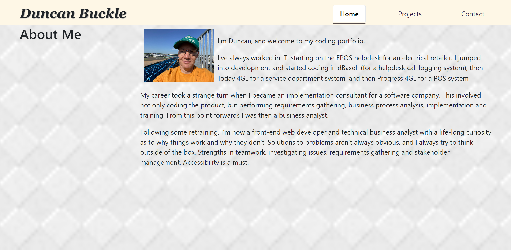
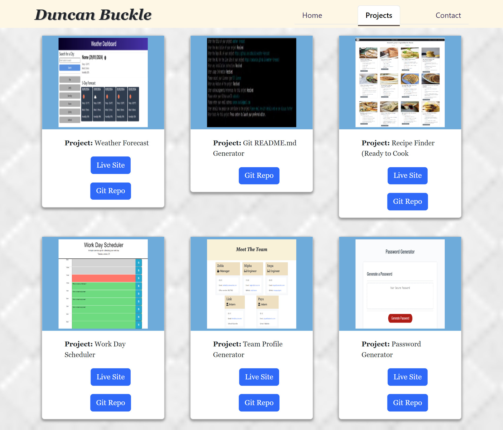
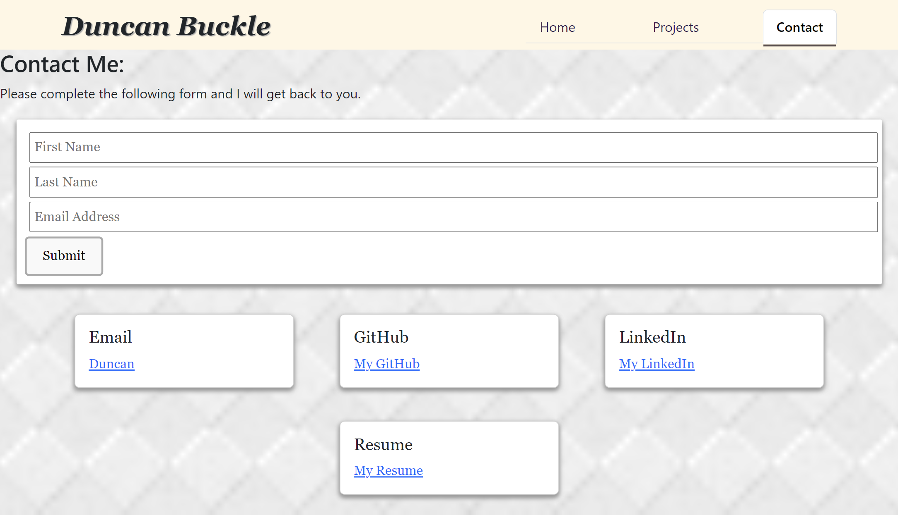

# REACT Created Portfolio

## Description
This is my portolio of code work now built with REACT.

## Table of Contents
* [Links](#links)
* [Installation](#installation)
* [Usage](#usage)
* [Screenshots](#screenshots)
* [Project Items](#project-items)
* [License](#license)
* [Features](#features)

## Links
* [Repo](https://github.com/cadbuckle/ReactPortfolio)

## Installation
If not already installed, please install node.
From the root of the app, please run "npm i" to install any additional required packages.

## Usage
From a bash prompt you mcan run npm run dev.  This will then provide you with a link you can open in your browser which will display the Portfolio page.
There are 3 tab options:
* Home - Display details about myself
* Projects - The top 6 projects I've worked on
* Contact - How you can contact me.

## Screenshots
### Home page
</img>
### Projects page
</img>
### Contacts page
</img>

## License
MIT License

## Features
JavaScript and REACT
* JavaScript
* React
* React Router for navigation
* Components

## Contributions
Please email me with details if you wish to contribute further to this app

## Acknowledgements
Thanks to:
* Bootcamp Lessons

## Questions?
My github profile can be found at https://github.com/cadbuckle
If you wish to contact me, you can email me at duncan.buckle@gmail.com

© 2024 Duncan B. Confidential and Proprietary. All Rights Reserved.